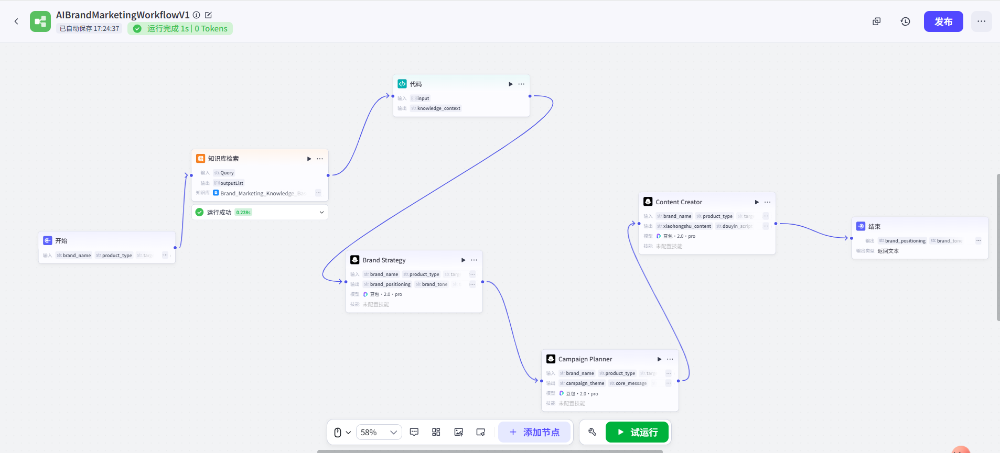
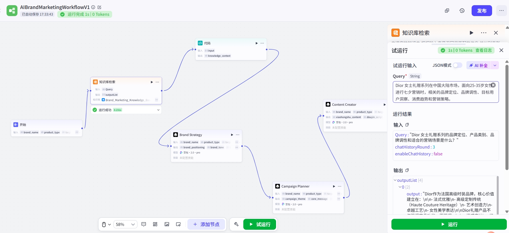
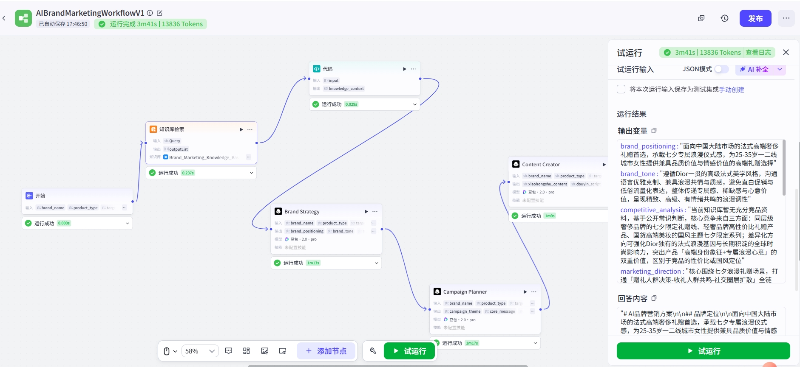

# AI Brand Marketing Workflow


> 基于 Coze Workflow、RAG 与 Prompt Engineering 搭建的端到端品牌营销 AI Workflow。

## Project Overview

本项目面向品牌营销方案生产场景，将 Marketing Brief、品牌知识检索、策略规划与内容生成串联为可运行的多阶段工作流。V1.0 已完成从结构化需求输入到营销方案输出的端到端闭环，并以 **Dior 七夕女士礼赠**为 Demo Case 完成测试。

项目重点不是替代营销团队的专业判断，而是验证 AI 产品经理如何将复杂任务拆解为可编排节点，通过 RAG、结构化上下文与事实约束，提高生成结果的品牌相关性和可控性。

## Problem

通用大模型直接生成品牌营销方案时，常见问题包括：

- Marketing Brief 信息不完整或表达不统一，导致下游任务目标漂移。
- 模型依赖通用品牌认知，容易输出泛化、同质化的策略内容。
- 品牌事实、行业洞察与策略推导边界不清，可能生成缺少依据的竞品信息。
- 品牌策略、Campaign 规划和内容生产集中在一次生成中，过程难以检查和迭代。
- 知识库召回结果未经整理直接进入 Prompt，噪声和格式差异影响模型理解。

## Solution

V1.0 将品牌营销任务拆解为一条可观察的 AI Workflow：

1. 通过结构化 Marketing Brief 接收品牌、产品类型、目标人群和营销目标等信息。
2. 根据任务生成检索 Query，并通过 RAG 获取品牌及营销知识。
3. 对召回结果进行 Query Rewrite、Hybrid Retrieval、Rerank 与 Top-K Retrieval。
4. 使用代码节点清洗和整理检索结果，形成统一的 `knowledge_context`。
5. 将 `knowledge_context` 注入 Brand Strategy Prompt，约束策略生成的事实范围。
6. 按 **Brand Strategy → Campaign Planner → Content Creator** 顺序完成多阶段生成。
7. 汇总各节点结果，输出结构化营销方案，便于复核和后续使用。

## Workflow Architecture

```text
Marketing Brief
      │
      ▼
Query Rewrite
      │
      ▼
Knowledge Retrieval
(Hybrid Retrieval → Rerank → Top-K)
      │
      ▼
Code Node: knowledge_context
      │
      ▼
Brand Strategy
      │
      ▼
Campaign Planner
      │
      ▼
Content Creator
      │
      ▼
Structured Marketing Output
```



*图 1：Coze Workflow V1.0 完整流程。画布展示了开始节点、知识库检索、`knowledge_context` 整理代码节点，以及 Brand Strategy、Campaign Planner、Content Creator 和最终输出节点之间的数据流。*

## RAG Design

RAG 模块用于为品牌策略节点提供与当前 Brief 相关的事实背景，而不是让模型仅依赖通用知识生成答案。

### Retrieval Pipeline

- **Query Rewrite**：将原始 Brief 转换为更适合知识库召回的问题表达。
- **Hybrid Retrieval**：结合不同检索信号，提高语义相关内容与关键词信息的覆盖。
- **Rerank**：对候选知识片段重新排序，优先保留与当前营销任务更相关的内容。
- **Top-K Retrieval**：控制进入下游节点的知识数量，减少无关上下文干扰。
- **Context Processing**：通过代码节点统一整理召回结果，输出 `knowledge_context`。
- **Prompt Injection**：将 `knowledge_context` 作为显式上下文注入 Brand Strategy Prompt，并要求区分品牌事实、行业信息和策略推导。



*图 2：Dior 女士礼赠场景的知识库检索测试。右侧展示检索 Query 与 Top-K 输出，用于验证品牌定位、产品类别、品牌调性和营销场景等信息能否被召回。*

## Key Features

- **结构化 Brief 输入**：将营销需求转换为稳定的工作流变量，减少自然语言输入差异。
- **品牌知识增强**：通过 RAG 为策略生成提供与任务相关的品牌及行业上下文。
- **可控上下文传递**：代码节点将检索结果整理为 `knowledge_context`，避免原始召回格式直接污染 Prompt。
- **多阶段 Agent 分工**：策略、Campaign 与内容生成分别处理，明确每个节点的输入、输出和职责。
- **事实边界约束**：Prompt 要求优先使用已检索知识，并标记资料不足的部分，降低无依据扩写。
- **结构化结果输出**：输出品牌定位、品牌调性、营销方向、Campaign 主题和内容建议等模块，便于人工复核。
- **可调试工作流**：可分别查看知识检索和各生成节点的运行结果，支持定位问题与迭代 Prompt。

## Demo Case

### Dior 七夕女士礼赠营销

Demo 以 Dior 女士礼赠系列在中国大陆市场的七夕营销场景作为输入，围绕目标人群、品牌定位、品牌调性、消费趋势与 Campaign 策略完成端到端测试。

测试链路包括：

1. 输入 Dior、女士礼赠、七夕场景及目标人群等 Brief 信息。
2. 检索品牌知识与消费营销洞察。
3. 整理 `knowledge_context` 并注入 Brand Strategy 节点。
4. 依次生成品牌策略、Campaign 规划与内容方向。
5. 汇总为结构化营销方案。



*图 3：Dior 七夕女士礼赠 Demo 的端到端运行结果。右侧展示结构化输出变量与回答内容，用于检查品牌定位、品牌调性、竞品分析边界和营销方向是否按节点传递。截图中的结果仅为测试输出，不代表 Dior 官方营销方案。*

## Evaluation / Before & After

V1.0 采用场景化对照测试检查工作流调整前后的输出差异，不使用虚构的商业指标或效率数据。

| 观察维度 | 调整前 | 增加 RAG 与事实约束 Prompt 后 |
| --- | --- | --- |
| 品牌知识来源 | 主要依赖模型通用认知 | 优先引用当前任务召回的品牌知识 |
| 输出相关性 | 容易出现通用奢侈品营销表达 | 更聚焦女士礼赠、七夕场景与已召回品牌信息 |
| 事实边界 | 可能将推测写成品牌或竞品事实 | 要求区分知识库事实、公开常识与策略建议 |
| 竞品分析 | 容易补全缺少依据的竞品细节 | 资料不足时限制具体事实生成，并保留信息缺口 |
| 调试方式 | 难以定位一次性生成中的问题 | 可分别检查 Retrieval、Strategy、Planning 与 Content 节点 |

当前 Evaluation 结论为定性验证：增加 RAG 和事实约束 Prompt 后，品牌知识泛化与无依据竞品事实生成得到降低。该结果仅适用于当前 Demo 和测试范围，不等同于真实商业效果。

## Tech Stack

| 类别 | 使用方式 |
| --- | --- |
| Coze Workflow | 节点编排、变量传递、试运行与结果检查 |
| Large Language Model | Brand Strategy、Campaign Planner、Content Creator 节点生成 |
| RAG | Query Rewrite、Hybrid Retrieval、Rerank、Top-K Retrieval |
| Code Node | 清洗召回结果并构造 `knowledge_context` |
| Prompt Engineering | 角色分工、输入输出约束、品牌事实边界与防幻觉规则 |
| Git / GitHub | 项目版本管理与作品集展示 |

## My Role

在该项目中，我以 AI 产品经理视角负责：

- 定义品牌营销场景、用户输入与 V1.0 产品边界。
- 将营销任务拆解为可执行的多阶段 Workflow。
- 设计 RAG 检索链路和 `knowledge_context` 的上下文传递方式。
- 设计 Brand Strategy、Campaign Planner 与 Content Creator 的节点职责及 Prompt 约束。
- 设计 Dior 七夕女士礼赠 Demo，并进行端到端试运行与结果复核。
- 针对品牌知识泛化和无依据竞品事实问题迭代 RAG 与 Prompt。
- 整理项目结构、截图证据和公开仓库的数据安全边界。

## Repository Structure

```text
.
├── README.md                  # 项目主页与 V1.0 方案说明
├── assets/                    # Workflow、RAG 与 Demo 运行截图
├── coze-workflow/
│   ├── designs/               # 工作流与节点设计
│   ├── exports/               # 脱敏后的平台导出资产预留目录
│   └── versions/              # 工作流版本记录
├── rag/
│   ├── knowledge_sources/     # 本地原始知识源，已被 .gitignore 排除
│   ├── processed/             # 清洗及切片结果预留目录
│   ├── schemas/               # 元数据结构预留目录
│   └── retrieval-tests/       # 检索测试预留目录
├── prompts/
│   ├── system/                # System Prompt 预留目录
│   ├── workflow-nodes/        # 工作流节点 Prompt 预留目录
│   ├── rag/                   # RAG Prompt 预留目录
│   └── versions/              # Prompt 版本记录
├── evaluation/
│   ├── datasets/              # 脱敏评测数据预留目录
│   ├── test-cases/            # 场景化测试用例
│   ├── rubrics/               # 评测标准
│   └── reports/               # 评测结果
├── docs/                      # 产品、架构与作品集文档
└── examples/                  # 脱敏的输入输出示例
```

当前公开仓库以 V1.0 项目说明、截图证据和可扩展目录结构为主；未公开 Coze 平台配置、原始知识源及未经脱敏的测试数据。

## Data & Copyright Notice

- 原始 RAG 知识源涉及品牌公开资料与行业研究内容，因版权、引用授权和公开范围限制，**不上传至 Public GitHub 仓库**，仅保留在本地用于 Demo 测试。
- `rag/knowledge_sources/` 已加入 `.gitignore`，不应被 Git 跟踪。
- Demo 截图仅用于说明 Workflow 设计与测试过程；截图中的品牌名称、商标及相关内容归各自权利人所有。
- 本项目为个人学习与 AI 产品经理作品集展示，不代表 Dior、QuestMobile 或其他机构的官方项目或商业合作。
- 仓库不包含 API Key、Token、密码或 Coze 平台密钥；任何后续公开的配置与数据都应先完成脱敏检查。
- 项目未使用或声称真实商业转化率、效率提升百分比或公司内部数据。

---

**Version:** V1.0  
**Status:** End-to-end demo completed; portfolio documentation in progress.
